# 
 STM32Keil安装 
## 1. 进入[Keil官网](https://www.keil.com/)，点击Product Downloads进入下载界面 
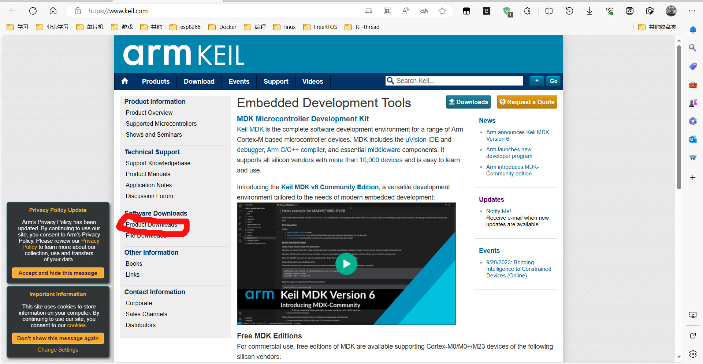 
## 2. 点击MDK-Arm 
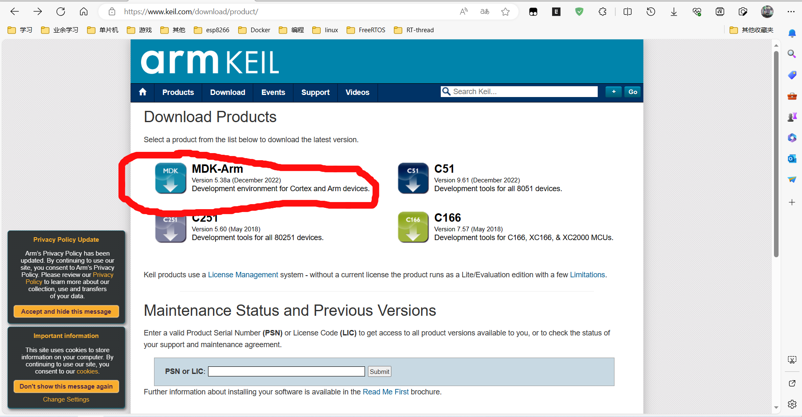 
## 3. 提交完对应信息后会弹出下载 
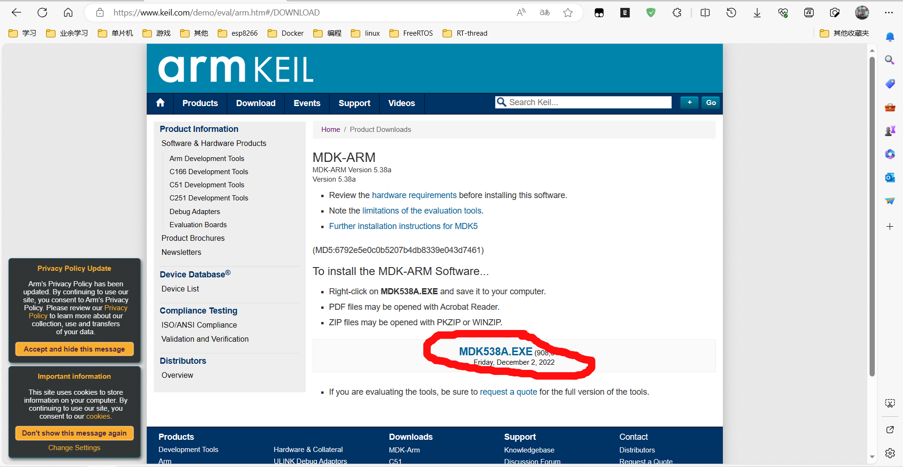 
## 4. 下载完之后直接双击打开就行了 
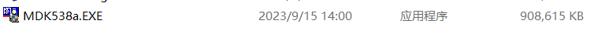
## 5.一路next，该agree的agree就好了，直到进入路径选择界面。如果有安装过51且没有卸载的话这里会默认使用keil的目录，打开Code目录看一眼，确保keil确实确实在这个文件里。如果没有装过keil就修改一下安装目录再next 
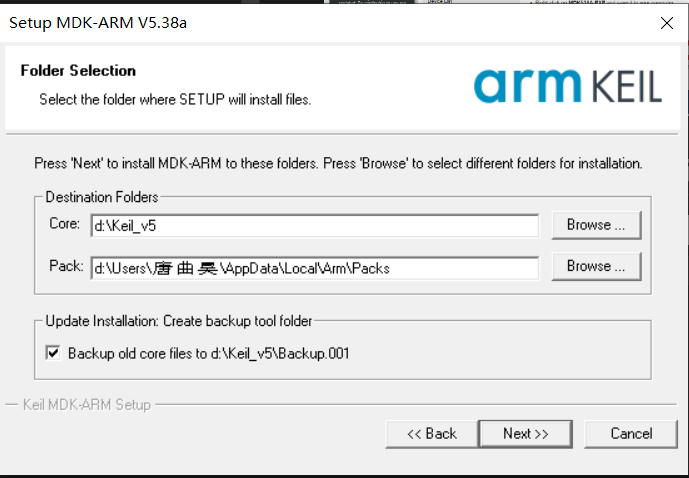 
## 6.接下来会让你再填一遍信息，随便填 
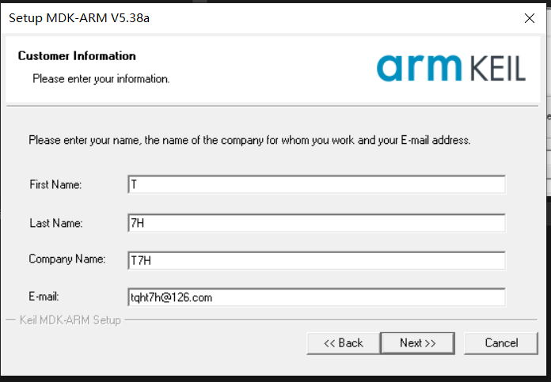 
## 7.安装完之后keil的快捷方式就会出现在桌面 
## 8.右键以管理员身份打开keil，点击左上角的File，点击Liscense Manager
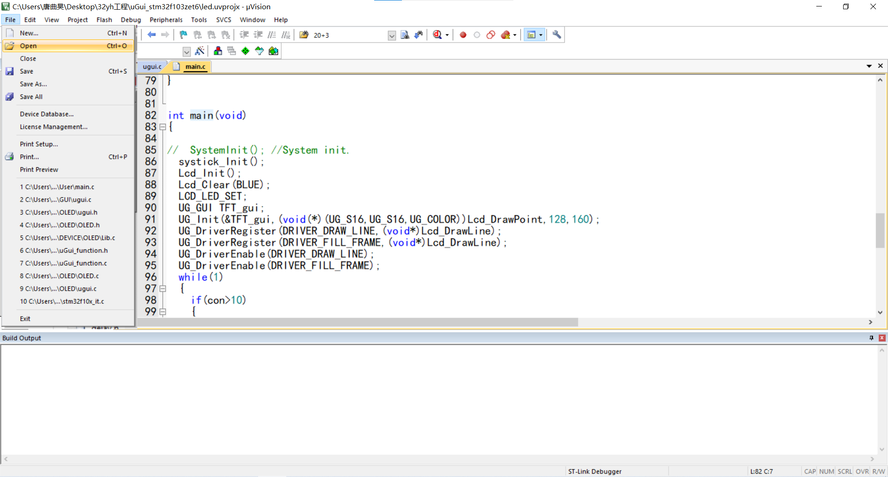
## 9.把那一串CID复制下来，下个keil的注册机，不用拘泥于2022还是2023~~网上有，直接搜就行了，或者找我要~~
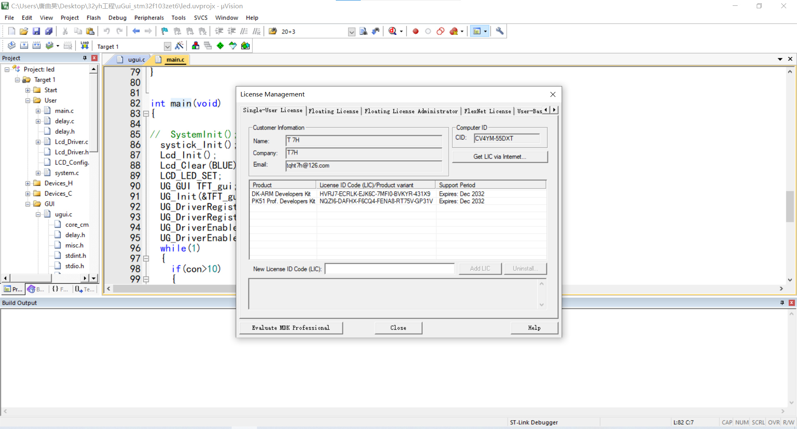
## 10.打开keil的注册机，记得关闭声音，把CID输入进去，把Target改成ARM，点击Generate会在下面一栏生成注册码，把那一串注册码复制下来
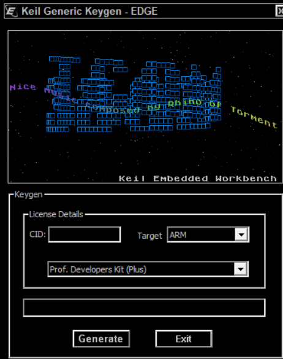
## 11.回到keil，把复制下来的注册码v到New License Code那一栏，点击 Add Lic就行了。安装完之后重新启动keil
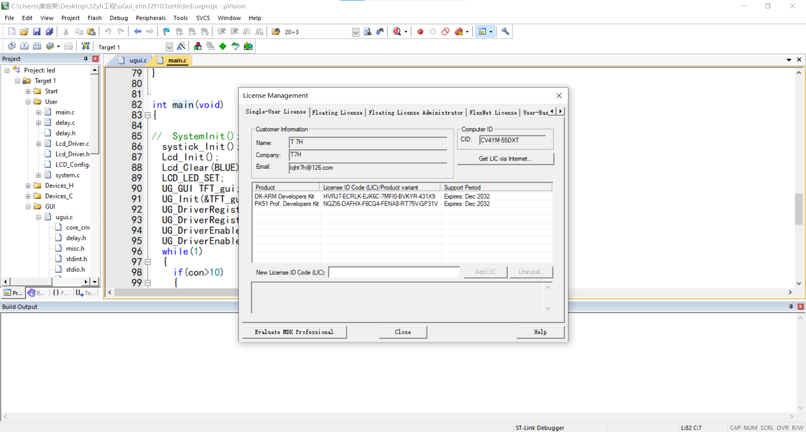
## 12.如果不出意外的话再次打开会出现这个界面。点击OK
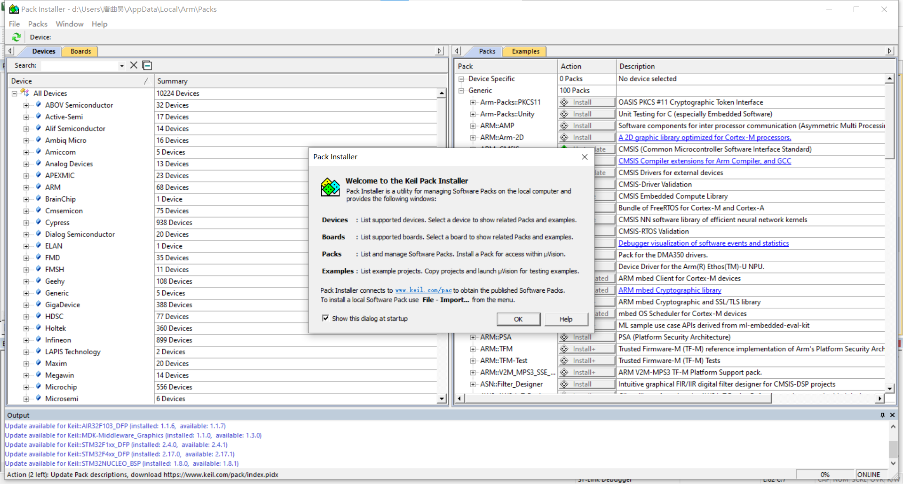
## 13. 在左边的一栏里找到这个
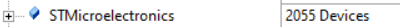
## 14. 点击前面的加号展开，找到对应的芯片型号展开，以STM32F401CBUX为例，展开到最后一级，点击芯片图标，会在右侧出现一个Device Specific的目录，点击目录下的Install，等待下方进度条跑完就可以关掉这个界面，就可以~~愉快地~~编代码去了。
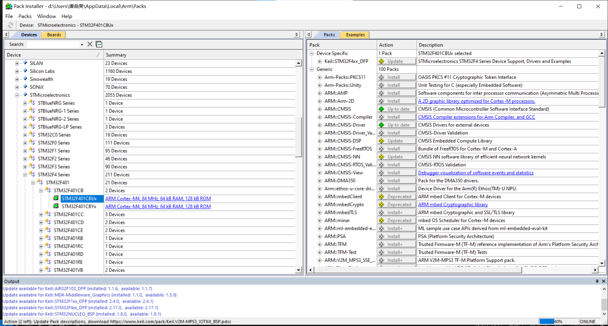
