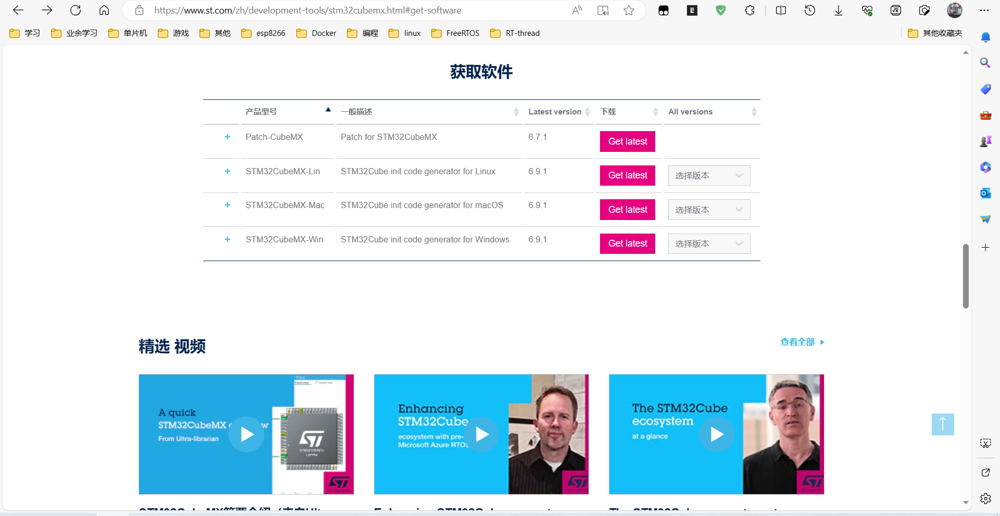
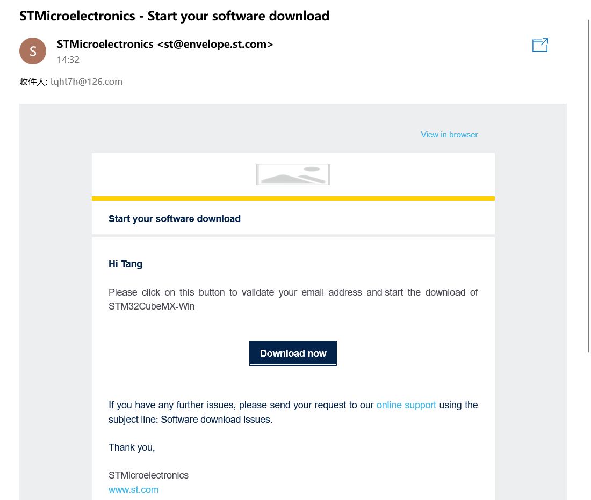

# 
STM32F4CubeMx安装  

##  进入[STM32官方网址](https://www.st.com/zh/development-tools/stm32cubemx.html#get-software)
### 点击获取软件

### 点击Get laster进入协议界面

### 直接点接受后会弹出填写信息的界面,填一下就行了,之后会向你填的邮箱里发送一封邮件，点击里面的链接就可以下载了。

### 下载完之后直接无脑下一步就行了<strong>(记得改下安装目录)</strong>
